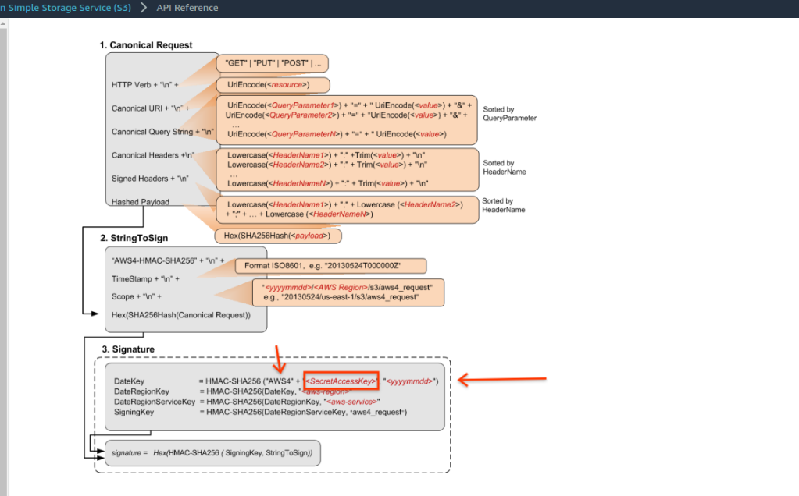
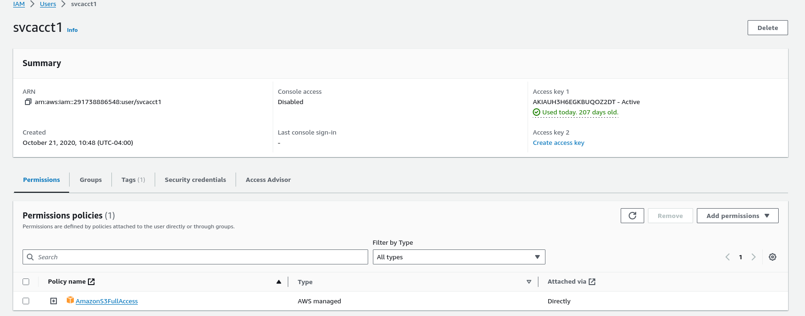
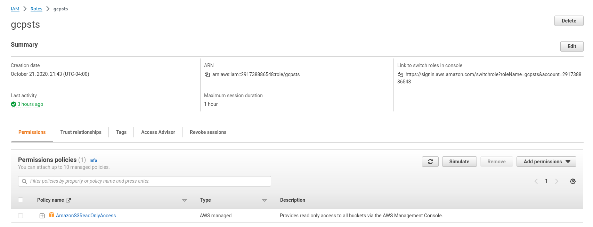
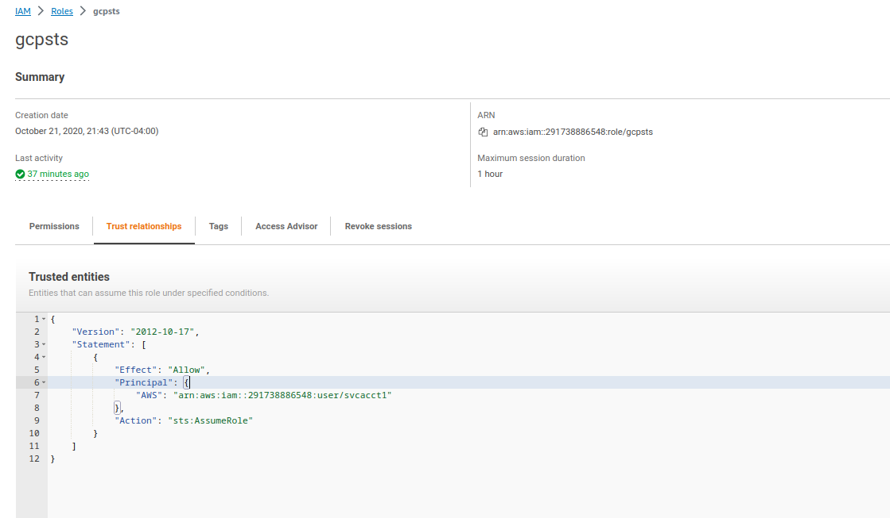

## AWS Credentials for Hardware Security Modules and TPM based AWS_SECRET_ACCESS_KEY

Sample procedure to **embed** AWS [Secret Access Keys](https://docs.aws.amazon.com/general/latest/gr/aws-sec-cred-types.html#access-keys-and-secret-access-keys) _inside_ an HSM device through [PKCS #11](https://en.wikipedia.org/wiki/PKCS_11), [Trusted Platform Module](https://en.wikipedia.org/wiki/Trusted_Platform_Module) and [Hashicorp Vault](https://www.vaultproject.io/).

The critical feature is, once the `AWS_SECRET_ACCESS_KEY` checks in, it never checks out, like a roach motel.  You ask the HSM and TPM to issue HMAC signature you can ultimately use for AWS Signatures v4 or more commonly, to access AWS resources.

This repo provides four ways to protect the aws secret:

1. Embed the secret into an `HSM` an access it via `PKCS11` `"github.com/salrashid123/aws_hmac/pkcs"`

2. Embed the secret into an `TPM` an access it via `go-tpm`  `"github.com/salrashid123/aws_hmac/tpm"`

3. Wrap the secret using `KMS` and access it via `TINK`. `"github.com/salrashid123/aws_hmac/tink"`

>> NOTE: This code is NOT Supported by Google; its just a POC. caveat emptor

---


* For TPM based process credentials, see [AWS Process Credentials for Trusted Platform Module (TPM)](https://github.com/salrashid123/aws-tpm-process-credential)
* For HSM based process credentials, see [AWS Process Credentials for Hardware Security Module (HSM) with PKCS11](https://github.com/salrashid123/aws-pkcs-process-credential)
  

For concrete usage see:

- [example/tpm](example/tpm)
- [example/pkcs](example/pkcs)
- [example/rest](example/rest)
- [example/tink](example/tink)

---

### AWS v4 Signing Protocol

While you can embed many types of keys to hardware like `TPM` or `HSM` or software key management system like `Vault`, applying those embedded keys to authenticate to AWS requires some background on how AWS signatures work.

The [AWS Signing](https://docs.aws.amazon.com/IAM/latest/UserGuide/reference_aws-signing.html) protocol uses the `AWS_SECRET_ACCESS_KEY` to create an HMAC signature by first adding a small prefix (`AWS4`) to the key.

What that means is if we can embed `AWS4$AWS_SECRET_ACCESS_KEY` into an HSM, we can ask it to perform an HMAC to kick off the first step in the whole signature process:

- 

Once we have the ability to generate an HMAC, we can ask the TPM for the first application and then perform the rest of the chain of operations outside.  The chain itself is shown in the diagram above and described [here](https://docs.aws.amazon.com/IAM/latest/UserGuide/create-signed-request.html)

This repo provides two variations to access AWS:

1.  Create a raw Signed AWS Request to access via REST
2.  Create an AWS SDK `Credential` which uses the HMAC signer as a credential provider for any go SDK for AWS.

Basically, this repo provides an `AWS Credential` _and_ a `Signerv4`.   You can use the former for any sdk operation and the later for standalone REST calls to AWS.

#### STS SessionToken and AssumeRole

AWS SDK's require an actual `AWS_SECRET_ACCESS_KEY` to perform its signature operation and cant' be 'given' a presigned URL to use.

This makes it a bit complicated on how to use an embedded key for an SDK which never sees the light of day outside of an HSM.

The workaround employed in this repo is a two step process to get a temporary  `AWS_SECRET_ACCESS_KEY` _derived_ from an initial Signerv4 request:

1. use the HSM embedded HMAC key to generate an AWS API call for either:

  * [sts.GetSessionToken()](https://docs.aws.amazon.com/STS/latest/APIReference/API_GetSessionToken.html)
  * [sts.AssumeRole()](https://docs.aws.amazon.com/STS/latest/APIReference/API_AssumeRole.html)

2. [Both APIs](https://docs.aws.amazon.com/IAM/latest/UserGuide/id_credentials_temp_request.html#stsapi_comparison) below will return a new temporary `AWS_ACCESS_KEY_ID`, `AWS_SECRET_ACCESS_KEY` and for the assumerole, a session.

3. Use these new keys as inputs to AWS Clients though a custom Credential object from this repo.

To use these samples end-to-end, you must hae an aws user, role and 'assumeRole" permissions as shown in the appendix

---

You can find example README files for each mode under `example/` folder.

---

### Usage: Signer with HTTP POST

You can use a signer to make an authenticate API calls directly.  

TO use this mode, initialize any of the HSM backends.  The following uses KMS and Tink to sign a REST API for `GetCallerIdentity` endpoint

```golang
	tinkSigner, err := hmacsigner.NewTinkSigner(&hmacsigner.TinkSignerConfig{
		TinkConfig: hmacsigner.TinkConfig{
			KmsBackend: backend,
			JSONBytes:  keysetbytes,    // this is the keyset bytes, i'm using json keyset
		},
		AccessKeyID: *accessKeyID,
	})

	hmacSigner := hmacsignerv4.NewSigner()

	fmt.Println("-------------------------------- Calling HTTP GET on  GetCallerIdentity using Tink Signer")

	emptyBody := strings.NewReader("")
	getCallerIdentityRequest, err := http.NewRequest(http.MethodGet, "https://sts.amazonaws.com?Action=GetCallerIdentity&Version=2011-06-15", emptyBody)

	hmacSigner.SignHTTP(ctx, *tinkSigner, getCallerIdentityRequest, emptyPayloadHash, "sts", *awsRegion, time.Now())

	getResponse, err := http.DefaultClient.Do(getCallerIdentityRequest)

	defer getResponse.Body.Close()

	var getCallerIdentityResponseStruct stsschema.GetCallerIdentityResponse

	getResponseData, err := io.ReadAll(getResponse.Body)

	err = xml.Unmarshal(getResponseData, &getCallerIdentityResponseStruct)

	log.Printf("GetCallerIdentityResponse UserID %s\n", getCallerIdentityResponseStruct.CallerIdentityResult.UserId)	
```


### Usage: AWS SDK Credentials from Signer 

```golang
	// first read the keyset from disk
	keysetbytes, err := os.ReadFile(*in)

	tinkSigner, err := hmacsigner.NewTinkSigner(&hmacsigner.TinkSignerConfig{
		TinkConfig: hmacsigner.TinkConfig{
			KmsBackend: backend,
			JSONBytes:  keysetbytes,
		},
		AccessKeyID: *accessKeyID,
	})

	hmacSigner := hmacsignerv4.NewSigner()

	sessionCredentials, err := hmaccred.NewAWSTinkCredentials(hmaccred.TINKProvider{
		GetSessionTokenInput: &sts.GetSessionTokenInput{
			DurationSeconds: aws.Int32(3600),
		},
		Version:    "2011-06-15",
		Region:     *awsRegion,
		TinkSigner: tinkSigner,
	})

	assumeRoleCredentials, err := hmaccred.NewAWSTinkCredentials(hmaccred.TINKProvider{
		AssumeRoleInput: &sts.AssumeRoleInput{
			RoleArn:         aws.String(*roleARN),
			RoleSessionName: aws.String(roleSessionName),
			DurationSeconds: aws.Int32(3600),
		},
		Version:    "2011-06-15",
		Region:     *awsRegion,
		TinkSigner: tinkSigner,
	})

// for sessiontokens:

	cfg, err := config.LoadDefaultConfig(context.TODO(), config.WithRegion(*awsRegion), config.WithCredentialsProvider(sessionCredentials))

	stssvc := sts.NewFromConfig(cfg, func(o *sts.Options) {
		o.Region = *awsRegion
	})

	stsresp, err := stssvc.GetCallerIdentity(ctx, &sts.GetCallerIdentityInput{})

	fmt.Printf("STS Identity from API %s\n", *stsresp.UserId)

// for assume role and s3

	fmt.Println("-------------------------------- Calling s3 list buckets using Tink Signer with AssumeRole")

	s3cfg2, err := config.LoadDefaultConfig(context.TODO(), config.WithRegion(*awsRegion), config.WithCredentialsProvider(assumeRoleCredentials))

	s3svc2 := s3.NewFromConfig(s3cfg2, func(o *s3.Options) {
		o.Region = *awsRegion
	})

	result2, err := s3svc2.ListBuckets(ctx, input)

	log.Println(len(result2.Buckets))
```

---

#### PKCS Usage Overview

With this, you are embedding the HMAC key *INTO* an HSM.  When you then need to access the secret, you ask the HSM to generate an HMAC for the AWS v4 signing process.   At no time does the client ever see the secret after it is embedded: the actual HMAC is done within the HSM. 

Once the key is embedded into an HSM, you can access it to sign, verify, etc but the key is ever exposed

```bash
$ pkcs11-tool --module /usr/lib/x86_64-linux-gnu/softhsm/libsofthsm2.so  --list-objects --pin mynewpin
	Secret Key Object; unknown key algorithm 43
	label:      HMACKey
	ID:         0100
	Usage:      verify
	Access:     sensitive
```

The big advantage of (2,3) is clear, the HSM owns the key and is not exportable:  nobody will see the raw key once thats done but yet you can use it to create an AWS s4 sign.

#### TPM Usage Overview

Similar to PKCS but here you are not using the cumbersome overlay that PKCS requires and directly using the embedded token from a `Trusted Platform Module (TPM)`.

To use this mode, your AWS must already be encoded to the TPM.  

You can do this directly on the TPM

- [Importing External HMAC and performing HMAC Signatures](https://github.com/salrashid123/tpm2/blob/master/hmac_import/README.md)

or remotely through a process like duplicate:

- [Duplicate an externally loaded HMAC key](https://github.com/salrashid123/tpm2/tree/master/tpm2_duplicate#duplicate-an-externally-loaded-hmac-key)

Please note the default signer here **requires** a persistentHandle.  If you would rather save/load from files, please file an issue (its relatively easy to adapt the import and signing), see

* [tpm_hmac file import](https://github.com/salrashid123/tpm2/tree/master/hmac_import)

You can also pass through an authorized session incase you bound the key to a policy like `PCRPolicy` or `PasswordPolicy`


#### TINK Usage Overview

In (4) you are using KMS to encrypt the Secret and save it in encrypted format.  When you need to access the Secret to make it generate an AWS v4 signing request, the raw Secret is automatically decrypted by TINK using KMS and made to HMAC sign.  The user will never need to "see" the secret but it is true that the key gets decrypted locally...  You will also need to have access to KMS in the first place so this example is a bit convoluted.   Use this if you already have access to another cloud providers KMS (eg GCP KMS), then use that decrypt the Key and then make it sign though the utility of this mechanism is limited since the hmac key is decrypted locally ultimately.

The encrypted Key would look like the following:

```json
{
	"encryptedKeyset": "CiUAmT+VVWAVKQZfFW6UheHPI1E3VmvTFlv2C4cspNaqpbxc8YvEEqUBACsKZVI1IW8U+86r2Yset0WOKwnggDitP0hi0oUapgOrF4W7Pklrbso93gfMoNDVw2QCWW4HwJwKzElQRi3zWHuL6NJP4t/t2VtIWORgWLz76zpH7+JWn6IrlqA/M4sammN0kAn+ZcgiG6kCvoMXzczUz3jzyk96Uz6U2LIuZb+bFaCasMYyka2fpSndMQ2SxpmHbVSe2AvhBVMLhM29LOcio41D",
	"keysetInfo": {
		"primaryKeyId": 2596996162,
		"keyInfo": [
			{
				"typeUrl": "type.googleapis.com/google.crypto.tink.HmacKey",
				"status": "ENABLED",
				"keyId": 2596996162,
				"outputPrefixType": "RAW"
			}
		]
	}
}
```
---


#### References

Some references for TINK and PKCS11:

- [Go PKCS11 Samples](https://github.com/salrashid123/go_pkcs11)
- [Importing external HMAC as TINK EncryptedKeySet](https://github.com/salrashid123/tink_samples/tree/main/external_hmac)

- User
  

- AWS Role
  

- AWS Assume Role Permissions
  

