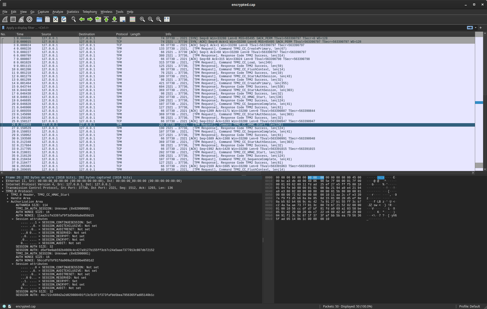

## Usage TPM

In this variation, you will embed the AWS HMAC key into a Trusted Platform Module (TPM).  One embedded, the key will never leave the device can only be accessed to "sign" similar to the PKCS example above.  To note, the TPM itself has a PKCS interface but at the moment, it does not support  HMAC operations like import.  See [Issue #688](https://github.com/tpm2-software/tpm2-pkcs11/issues/688). 


also see [awsv4signer: aws-sdk-go pluggable request signer](https://github.com/psanford/awsv4signer)


First step is to load the hmac key onto a TPM.  You can use `go-tpm`

import your aws secret using `go-tpm` or or via `tpm2_tools`.  

You can also securely transfer/duplicate an HMAC key from one TPM to another.  For that flow, see [Duplicate an externally loaded HMAC key](https://github.com/salrashid123/tpm2/tree/master/tpm2_duplicate#duplicate-an-externally-loaded-hmac-key).


do either A or B to import the key and then run the aws sdk client

#### A. Import HMAC key using tpm2_tools

If you installed `tpm2_tools`, then you can either directly import a key or do a secure sealed duplication (see [tpm2_duplicate](https://github.com/salrashid123/tpm2/tree/master/tpm2_duplicate))

The following does a direct import

```bash
export AWS_ACCESS_KEY_ID=AKIAUH3H6EGK-redacted

export secret="AWS4$AWS_SECRET_ACCESS_KEY"
echo -n $secret > hmac.key
hexkey=$(xxd -p -c 256 < hmac.key)
echo $hexkey

### create primary object on owner hierarchy
### this primary is the "H2" credential profile
### pg 43 [TCG EK Credential Profile](https://trustedcomputinggroup.org/wp-content/uploads/TCG_IWG_EKCredentialProfile_v2p4_r2_10feb2021.pdf)
### which allows compatibility https://www.hansenpartnership.com/draft-bottomley-tpm2-keys.html#name-parent)
printf '\x00\x00' > unique.dat
tpm2_createprimary -C o -G ecc  -g sha256  -c primary.ctx -a "fixedtpm|fixedparent|sensitivedataorigin|userwithauth|noda|restricted|decrypt" -u unique.dat

tpm2 import -C primary.ctx -G hmac -i hmac.key -u hmac.pub -r hmac.priv
tpm2_flushcontext -t
tpm2 load -C primary.ctx -u hmac.pub -r hmac.priv -c hmac.ctx

## encode as PEM
tpm2_encodeobject -C primary.ctx -u hmac.pub -r hmac.priv  -o private.pem

# evict it to handle 0x81008001
tpm2_evictcontrol -C o -c hmac.ctx 0x81008001 
tpm2_flushcontext -t
```

Also see [Importing External HMAC and performing HMAC Signature](https://github.com/salrashid123/tpm2/tree/master/hmac_import))

---

#### B. Import HMAC key using go-tpm

```bash
cd example/tpm

### load the hmac key into the TPM (i'm using the software swtpm in socket mode)
## eg
#### rm -rf /tmp/myvtpm && mkdir  /tmp/myvtpm
#### sudo swtpm socket --tpmstate dir=/tmp/myvtpm --tpm2 --server type=tcp,port=2321 --ctrl type=tcp,port=2322 --flags not-need-init,startup-clear 

$ go run create/main.go --tpm-path="127.0.0.1:2321" \
   -accessKeyID=$AWS_ACCESS_KEY_ID -secretAccessKey=$AWS_SECRET_ACCESS_KEY


-----BEGIN TSS2 PRIVATE KEY-----
MIHyBgZngQUKAQMCBQCAAAAABDIAMAAIAAsABABSAAAABQALACARtTINyP8V6vtY
+rQgUZGuCdIC2M5nKogtjdpCuy0bRQSBrACqACCvE1r0clA9W8id4FJ/2OEKPZrC
wqFqkwFm1/l67eVQfwAQ+b5BGhOLbO0HSlHbFC1lgAh9EeefG97VL6iSh1EHT2oo
KSxrKjuK/EruAQxaOS9Kl/yooai6TJtlgxA7GHGzqetCpXvcq5EtJBVwV3lXJyil
4CPyaPh3C02I9J+2QAnLsVzlPYODcjRKEUqMlO6CDijxURnU5BdYUehpZaq11tJv
xr9pHcM=
-----END TSS2 PRIVATE KEY-----
```

#### Run AWS Client

Now the key is setup on the TPM, we can use it to issue credentials:

```bash
$ go run load/main.go --tpm-path="127.0.0.1:2321"    --accessKeyID=$AWS_ACCESS_KEY_ID -in /tmp/private.pem --roleARN=$AWS_ROLE_ARN

-------------------------------- Calling HTTP POST on  GetCallerIdentity using TPM Signer
GetCallerIdentityResponse UserID AIDAUH3H6EGKJS3TUUUSY
-------------------------------- GetCallerIdentity with SessionToken SDK
STS Identity from ARN arn:aws:iam::291738886548:user/testservice
STS Identity from API AIDAUH3H6EGKJS3TUUUSY
-------------------------------- GetCallerIdentity with AssumeRole SDK
Assumed role ARN: arn:aws:sts::291738886548:assumed-role/cicdrole/mysession
```

What the two script above does is 

1. opens tpm
2. creates a primary tpm context
3. creates a tpm public and private sections for HMAC
4. set the 'sensitive' part of the private key to the raw AWS secret
5. imports the public hmac key to the tpm
6. writes the _handle_ to that hmac to a persistent handle (you can also write to files compatible with [ASN.1 Specification for TPM 2.0 Key Files](https://www.hansenpartnership.com/draft-bottomley-tpm2-keys.html#name-parent) ).

After the key is embedded to the persistent handle, you can reuse that between reboots (no need to reimport the raw key)

* Note, the key we generate has the following attributes

```bash
## to read the persistent handle of the key:
$ tpm2_readpublic -c 0x81008001

name: 000bc8aec7b8022771083c4fb6779ddb55dc29bb59d434233d928c195427176a8b1b
qualified name: 000b1a795c6cfe87728cc81e35dbfe1c77c6a47499cc6c650c836587da610c842913
name-alg:
  value: sha256
  raw: 0xb
attributes:
  value: userwithauth|sign
  raw: 0x40040
type:
  value: keyedhash
  raw: 0x8
algorithm: 
  value: hmac
  raw: 0x5
hash-alg:
  value: sha256
  raw: 0xb
keyedhash: 53627dea456e7a94594b4e49be22a44c12272d45e3d2f0a2adf20c566ceb6d92

## to read the PEM format of the key:

$ cat private.pem 
-----BEGIN TSS2 PRIVATE KEY-----
MIH3BgZngQUKAQOgAwEB/wIFAIAAAAAEMgAwAAgACwAEAEAAAAAFAAsAIDdNY1TO
+cDEnS5teIu6W5zBkn3gu3a7hDUJCtWmklNxBIGsAKoAIAXDM2cgiYMKPTdKhmFn
7hi4/yJEGK2dEm2zxcgAm/XiABCsRiDFuzWlPUIr1pkLFx7Kr3RRmRKCaQK5bpa8
0dCxjL2WbPtCMTMr2mrzIrjZZURYTlanCmU2OMUmjZ9o7qvKAuVHi9zjRfJ5WN52
p/COQgdyNbLObKw0J5FvUeEpxEczRme/9VtlKRqNG3TGb+CGbyCxcy6mLAylMXuV
/CRDoQLEHPOcDg==
-----END TSS2 PRIVATE KEY-----

```


### Session policy

You can supply a fulfilled session policy into this library (eg a PCR policy).

For example, the following uses a software TPM:

```bash
$ rm -rf /tmp/myvtpm && mkdir /tmp/myvtpm
$ sudo swtpm socket --tpmstate dir=/tmp/myvtpm --tpm2 --server type=tcp,port=2321 --ctrl type=tcp,port=2322 --flags not-need-init,startup-clear
```

#### Password Policy

To use this mode, first setup a key with a Password policy (password is `testpwd`)

```bash
export AWS_ACCESS_KEY_ID=AKIAUH3H6EGK-redacted

export secret="AWS4$AWS_SECRET_ACCESS_KEY"
echo -n $secret > hmac.key
hexkey=$(xxd -p -c 256 < hmac.key)
echo $hexkey

printf '\x00\x00' > unique.dat
tpm2_createprimary -C o -G ecc  -g sha256  -c primary.ctx -a "fixedtpm|fixedparent|sensitivedataorigin|userwithauth|noda|restricted|decrypt" -u unique.dat

tpm2_import -C primary.ctx -G hmac -i hmac.key -u hmac.pub -r hmac.priv -p testpwd
tpm2_flushcontext -t
tpm2_load -C primary.ctx -u hmac.pub -r hmac.priv -c hmac.ctx 
tpm2_flushcontext -t
tpm2_evictcontrol -C o -c hmac.ctx 0x81008001
```

```golang
	hmacKey := tpm2.TPMHandle(*persistentHandle)
	pub, err := tpm2.ReadPublic{
		ObjectHandle: hmacKey,
	}.Execute(rwr)

	p, err := hmacsigner.NewPasswordSession(rwr, []byte("testpwd"))

	tpmSigner, err := hmacsigner.NewTPMSigner(&hmacsigner.TPMSignerConfig{
		TPMConfig: hmacsigner.TPMConfig{
			TPMDevice: rwc,
			NamedHandle: tpm2.NamedHandle{
				Handle: hmacKey,
				Name:   pub.Name,
			},
			AuthSession:      p,
			EncryptionHandle: createEKRsp.ObjectHandle,
			EncryptionPub:    encryptionPub,
		},
		AccessKeyID: *accessKeyID,
	})
```

Then,

```bash
$ go run policy_password/main.go --tpm-path="127.0.0.1:2321" \
   --accessKeyID=$AWS_ACCESS_KEY_ID --persistentHandle 0x81008001 --roleARN="arn:aws:iam::291738886548:role/gcpsts"
```

#### PCR Policy

For PCR policy, you do the same except set:

```bash
export AWS_ACCESS_KEY_ID=AKIAUH3H6EGK-redacted

export secret="AWS4$AWS_SECRET_ACCESS_KEY"
echo -n $secret > hmac.key
hexkey=$(xxd -p -c 256 < hmac.key)
echo $hexkey

printf '\x00\x00' > unique.dat
tpm2_createprimary -C o -G ecc  -g sha256  -c primary.ctx -a "fixedtpm|fixedparent|sensitivedataorigin|userwithauth|noda|restricted|decrypt" -u unique.dat

tpm2_startauthsession -S session.dat
tpm2_pcrread sha256:23 -o pcr23_val.bin
tpm2_policypcr -S session.dat -l sha256:23 -f pcr23_val.bin -L policy.dat
tpm2_flushcontext session.dat
tpm2_flushcontext -t
tpm2_import -C primary.ctx -G hmac -i hmac.key -u hmac.pub -r hmac.priv -L policy.dat
tpm2_flushcontext -t
tpm2_load -C primary.ctx -u hmac.pub -r hmac.priv -c hmac.ctx 
tpm2_flushcontext -t
tpm2_evictcontrol -C o -c hmac.ctx 0x81008002
tpm2_flushcontext -t
```

then in code 


```golang
	hmacKey := tpm2.TPMHandle(*persistentHandle)
	pub, err := tpm2.ReadPublic{
		ObjectHandle: hmacKey,
	}.Execute(rwr)

	p, err := hmacsigner.NewPCRSession(rwr, []tpm2.TPMSPCRSelection{
		{
			Hash:      tpm2.TPMAlgSHA256,
			PCRSelect: tpm2.PCClientCompatible.PCRs(23),
		},
	})


	tpmSigner, err := hmacsigner.NewTPMSigner(&hmacsigner.TPMSignerConfig{
		TPMConfig: hmacsigner.TPMConfig{
			TPMDevice: rwc,
			NamedHandle: tpm2.NamedHandle{
				Handle: hmacKey,
				Name:   pub.Name,
			},
			AuthSession:      p,
			EncryptionHandle: createEKRsp.ObjectHandle,
			EncryptionPub:    encryptionPub,
		},
		AccessKeyID: *accessKeyID,
	})
```

### Custom Policy

You can define your own policy for import too...just implement the "session" interface from the signer:

```golang
type Session interface {
	GetSession() (auth tpm2.Session, closer func() error, err error) // this supplies the session handle to the library
}
```

for example, for a PCR and [AuthPolicy](https://github.com/google/go-tpm/pull/359) enforcement (eg, a PCR and password), you can define a custom session callback

```golang
type MyPCRAndPolicyAuthValueSession struct {
	rwr      transport.TPM
	sel      []tpm2.TPMSPCRSelection
	password []byte
}

func NewPCRAndPolicyAuthValueSession(rwr transport.TPM, sel []tpm2.TPMSPCRSelection, password []byte) (MyPCRAndPolicyAuthValueSession, error) {
	return MyPCRAndPolicyAuthValueSession{rwr, sel, password}, nil
}

func (p MyPCRAndPolicyAuthValueSession) GetSession() (auth tpm2.Session, closer func() error, err error) {

	var options []tpm2.AuthOption
	options = append(options, tpm2.Auth(p.password))

	sess, closer, err := tpm2.PolicySession(p.rwr, tpm2.TPMAlgSHA256, 16, options...)
	if err != nil {
		return nil, nil, err
	}

	_, err = tpm2.PolicyPCR{
		PolicySession: sess.Handle(),
		Pcrs: tpm2.TPMLPCRSelection{
			PCRSelections: p.sel,
		},
	}.Execute(p.rwr)
	if err != nil {
		return nil, nil, err
	}

	_, err = tpm2.PolicyAuthValue{
		PolicySession: sess.Handle(),
	}.Execute(p.rwr)
	if err != nil {
		return nil, nil, err
	}

	return sess, closer, nil
}
```

which you can call as:

```golang
	p, err := NewPCRAndPolicyAuthValueSession(rwr, []tpm2.TPMSPCRSelection{
		{
			Hash:      tpm2.TPMAlgSHA256,
			PCRSelect: tpm2.PCClientCompatible.PCRs(uint(*pcr)),
		},
	}, []byte("testpswd"))

	tpmSigner, err := hmacsigner.NewTPMSigner(&hmacsigner.TPMSignerConfig{
		TPMConfig: hmacsigner.TPMConfig{
			TPMDevice: rwc,
			NamedHandle: tpm2.NamedHandle{
				Handle: hmacKey,
				Name:   pub.Name,
			},
			AuthSession:      p,
			EncryptionHandle: createEKRsp.ObjectHandle,
			EncryptionPub:    encryptionPub,
		},
		AccessKeyID: *accessKeyID,
	})
```

### Session Encryption

This library also supports [Encrypted Sessions](https://github.com/salrashid123/tpm2/tree/master/tpm_encrypted_session) which will encrypt the traffic between the CPU and TPM bus.

To enable, this, acquire key you know is on the TPM (eg like the endorsement key from some other prior run).  The example i've provided in this repo i acquire the EK during the runtime itself
whcih means the traffic to get the key isn't encrypted though...its just expected you got this key earlier.

Anyway, once its acquired, you can pass the encryption key key and name to this library




### SoftwareTPM

If you want to use a software tpm to test

```bash
rm -rf /tmp/myvtpm && mkdir /tmp/myvtpm  && \
   sudo swtpm_setup --tpmstate /tmp/myvtpm --tpm2 --create-ek-cert && \
   sudo swtpm socket --tpmstate dir=/tmp/myvtpm --tpm2 --server type=tcp,port=2321 --ctrl type=tcp,port=2322 --flags not-need-init,startup-clear --log level=5

export TPM2TOOLS_TCTI="swtpm:port=2321"
```